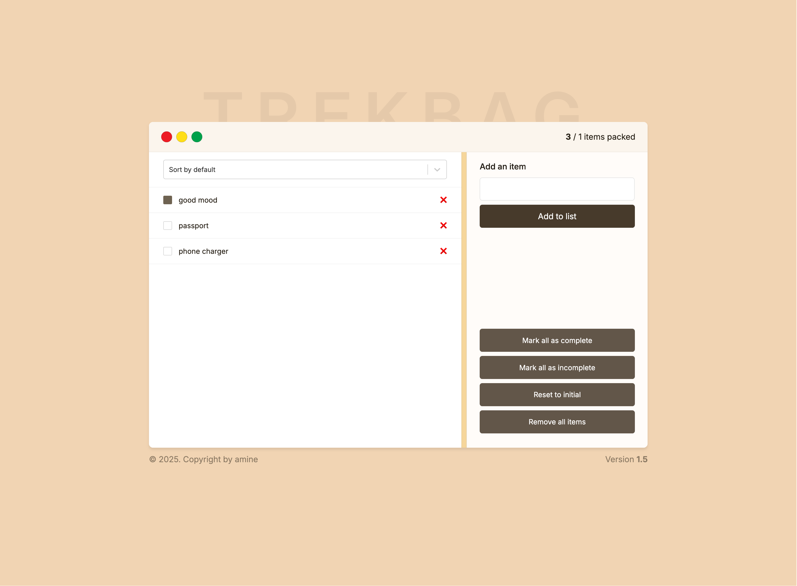

# Trekbag

TrekBag is a lightweight React-based application designed to help users manage and organize their travel or hiking gear efficiently. It provides an intuitive interface for adding, removing, and categorizing items in a checklist format.

## Features

* Add, remove, and update items in your gear list

* Organized item categories for easy navigation

* Responsive UI for seamless experience across devices

* State management using Zustand

* Built with Vite for fast development and build times

## Installation

To set up the project locally, follow these steps:

1. Clone the repository:

```bash
git clone https://github.com/aminetiouk/trekbag
cd trekbag
```
2. Install dependencies using PNPM:

```bash
pnpm install
```

3. Start the development server:

```bash
pnpm dev
```

4. Build for production:

```bash
pnpm build
```

## Site Preview

### Screenshot


### Live Demo
You can view a live demo of the TrekBag application >> [Here](https://trekbag-eight.vercel.app/)


## Technologies Used

* React 19 - Component-based UI

* Vite - Fast bundler and development server

* Zustand - Lightweight state management

* ESLint - Code linting and formatting

* React Select - Enhanced 

## Contributing

Contributions are welcome! If you find any issues or have feature suggestions, please open an issue or submit a pull request.
